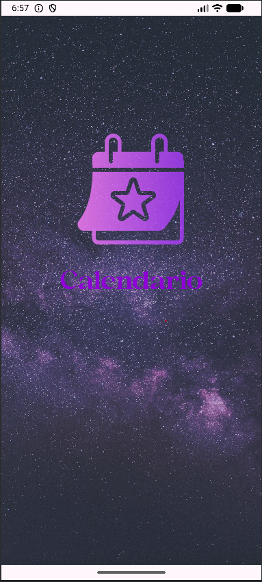
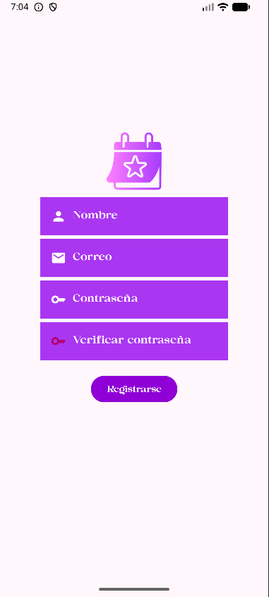
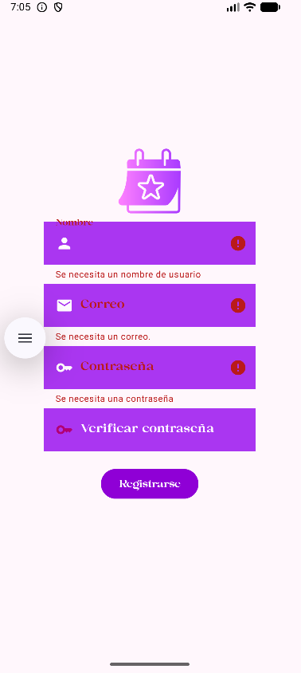
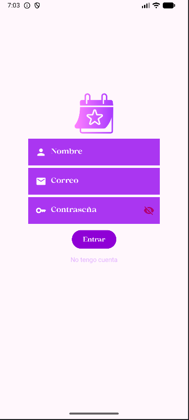
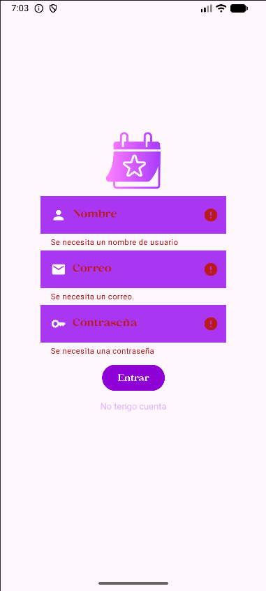
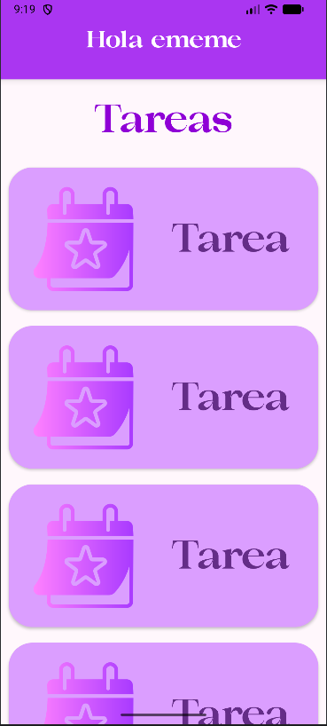
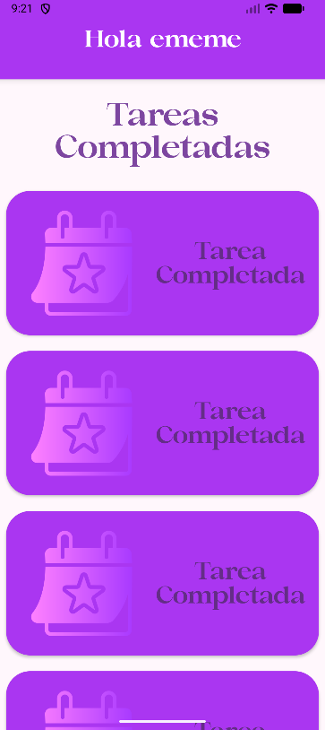

# **Actividad 1**

Aplicación **Android** que implementa un sistema básico de **registro** e **inicio de sesión** utilizando almacenamiento local seguro.  
La aplicación permite **registrar usuarios**, **validar credenciales** y **mostrar un saludo personalizado** al iniciar sesión.

Incluye las siguientes pantallas:

### **SplashScreen**
Pantalla de bienvenida con animación.

  

### **RegistrarActivity**
Formulario de registro con validaciones.

  
  

### **LoginActivity**
Pantalla de inicio de sesión con comprobación de datos guardados.

  
  

Proyecto desarrollado como práctica para la **creación de interfaces**, **validación de datos** y **manejo de sesiones** en Android.

## **Selección de colores**

La aplicación utiliza una paleta basada en **tonos morados y rosas**, elegidos por su asociación con lo **mágico**, lo **especial** y lo **desconocido**.  
Estos colores buscan transmitir la idea de que **cada día puede ser algo místico, algo que vale la pena disfrutar y explorar**.  
El diseño visual refuerza así el propósito de la app: inspirar al usuario a vivir su rutina con un sentido de maravilla y descubrimiento.

---

# **Actualización de Main**

## **Vista general de la Pantalla Principal**

La pantalla principal ahora se divide en **dos columnas**:
- Una dedicada a las **tareas activas**.
- Otra para las **tareas que el usuario ya ha completado**.

<strong>Tareas activas</strong>  

<strong>Tareas terminadas</strong>  

### **Header con saludo personalizado**

La pantalla incluye un **header** que saluda al usuario utilizando el **nombre introducido en el login**.
